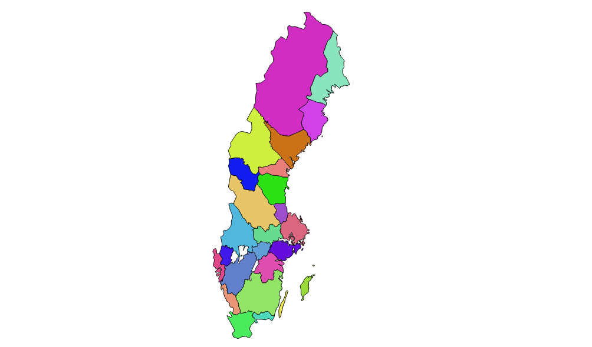

Svenska Landskap
================

[Sveriges landskap](https://sv.wikipedia.org/wiki/Landskap_i_Sverige) som öppen geodata i [GeoJSON](http://geojson.org/)-format. [Utforska med interaktiv karta](http://www.liedman.net/svenska-landskap/).

Att hitta en detaljerad [karta över Hisingens landskapsgräns](https://twitter.com/manierahl/status/844257440090783746) visar sig förvånansvärt svårt, och att ens hitta grunddata är icke-trivialt. Det här repot försöker råda bot på problemet genom att publicera Sveriges landskap som GeoJSON.

Datat bygger på [Lantmäteriets Distriktskarta](https://www.lantmateriet.se/sv/Kartor-och-geografisk-information/Kartor/Geografiska-teman/gsd-distriktsindelning/) och är öppen data licensierad som [CC0](https://creativecommons.org/publicdomain/zero/1.0/).

Repot innehåller två dataset:

* `svenska-landskap.geo.json` - Sveriges landskap från Distriktkartan, men simplifierad med en tolerans på 5 meter
* `svenska-landskap-klippt.geo.json` - samma som ovan, men även klippt mot Sveriges kustlinje; detta ser bättre ut på översiktsbilder, då Sveriges kustlinje blir mer naturlig, framför allt undviker det ett grafiskt osnyggt problem med Gotland och Fårö
